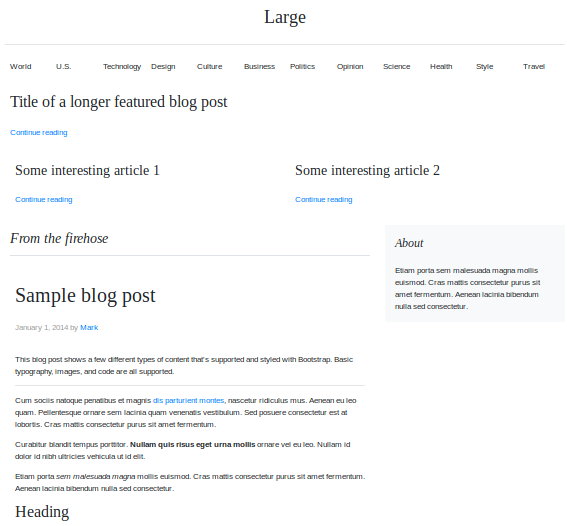

# additive-guis

## declarative layouts

GUIs can be buildable through declarative tuples where each statement changes the layout of an application. This is an idea inspired by RDF N3 tuples and [Bloom lang](http://bloom-lang.net/). I call these additive Guis because the code that generates the UI is a monotonically increasing set of statements that can arrive in any order and still produce a sensible, valid output GUI.

Rules look like this:

```
todoField above todosList
todosList above todoFilters
submitTodo rightOf todoField
```

Each rule is relative to every other rule. The rules together produce an emergent layout. Here's a list of predicates implemented so far:

# leftOf

The widget should be to the left of another widget.

# rightOf

The widget should be to the right of another widget.

# above

The wiget appears somewhere above - nearer the top of the screen compared to the other widget.

# under

The widget should appear directly underneath.

# below

The widget appears on the screen after this widget but not necessarily directly underneath.

# Example

You have this set of predicates - a bit like N3 tuples - of how your page should be put together and behave. This is a port of the [Bootstrap's Blog example](https://getbootstrap.com/docs/4.0/examples/blog/) as an additive GUI.

blog_post.json
```
{
	"predicates": [
		[
			"header hasSize 12",
			"menu hasSize 12",
			"header centered screen",
			"menu centered screen",
			"header above menu",
			"menu above heroPost",
			"heroPost above featuredPosts",
			"heroPost hasSize 12"
		],
		[
			"blogs hasSize 8",
			"blogSidebar hasSize 4"
		]
	],
	"widgets": {
		"header": {
			"predicates": [
				"logo hasSize 12"
			],
			"classes": "blog-header py-3 justify-content-between align-items-center text-center"
		},
		"featuredPosts": {
			"predicates": [
				"featuredPostA hasSize 6",
				"featuredPostB hasSize 6",
				"featuredPostB rightOf featuredPostA"
			]
		},
		"featuredPostB": {
			"predicates": [
				"featuredPostContentB leftOf imageB"
			],
			"classes": "card flex-md-row mb-4 box-shadow h-md-250"
		},
		"featuredPostA": {
			"predicates": [
				"featuredPostContentA leftOf imageA"
			],
			"classes": "card flex-md-row mb-4 box-shadow h-md-250"
		},
		"categoryA": {
			"html": "<strong class=\"d-inline-block mb-2 text-primary\">World<\/strong>"
		},
		"categoryB": {
			"html": "<strong class=\"d-inline-block mb-2 text-primary\">Technology<\/strong>"
		},
		"featuredPostContentA": {
			"predicates": [
				"categoryA above featuredPostHeadingA",
				"featuredPostHeadingA above featuredPostDateA",
				"featuredPostDateA above featuredIntroA",
				"featuredPostDateA below categoryA"
			],
			"classes": "card-body d-flex flex-column align-items-start"
		},
		"featuredPostContentB": {
			"predicates": [
				"categoryB above featuredPostHeadingB",
				"featuredPostHeadingB above featuredPostDateB",
				"featuredPostDateB above featuredIntroB",
				"featuredPostDateB below categoryB"
			],
			"classes": "card-body d-flex flex-column align-items-start"
		},
		"featuredIntroA": {
			"html": "<p class=\"card-text mb-auto\">This is a wider card with supporting text below as a natural lead-in to additional content.<\/p>"
		},
		"featuredIntroB": {
			"html": "<p class=\"card-text mb-auto\">This is a wider card with supporting text below as a natural lead-in to additional content.<\/p>"
		},
		"featuredPostHeadingA": {
			"html": "<h3 class=\"mb-0\">\r\n                <a class=\"text-dark\" href=\"#\">Featured post<\/a>\r\n              <\/h3>"
		},
		"featuredPostHeadingB": {
			"html": "<h3 class=\"mb-0\">\r\n                <a class=\"text-dark\" href=\"#\">Featured post<\/a>\r\n              <\/h3>"
		},
		"featuredPostDateA": {
			"html": "<div class=\"mb-1 text-muted\">Nov 12</div>"
		},
		"featuredPostDateB": {
			"html": "<div class=\"mb-1 text-muted\">Nov 12</div>"
		},
		"imageA": {
			"html": ""
		},
		"imageB": {
			"html": ""
		},
		"menu": {
			"predicates": [
				"siblings hasDefaultSize 1",
				"U.S. rightOf World",
				"Technology rightOf U.S.",
				"Design rightOf Technology",
				"Culture rightOf Design",
				"Business rightOf Culture",
				"Politics rightOf Business",
				"Opinion rightOf Politics",
				"Science rightOf Opinion",
				"Health rightOf Science",
				"Style rightOf Health",
				"Travel rightOf Style"
			]
		},
		"heroPost": {
			"predicates": [
				"heroText above continueReadingLink"
			],
			"classes": "jumbotron p-3 p-md-5 text-white rounded bg-dark"
		},
		"blogs": {
			"predicates": [
				"introduction above blogPost"
			]
		},
		"blogPost": {
			"predicates": [
				"blogHeading above postMetadata",
				"posting under postMetadata"
		]},
		"blogSidebar": {
			"predicates": [
				"aboutSection centered screen"
			],
			"classes": "bg-light"
		},
		"aboutSection": {
			"predicates": [
				"aboutTitle above aboutText",
				"aboutText hasSize 12"
			]
		},
		"blogHeading": {
			"html": "<h1>Sample blog post</h1>"
		},
		"postMetadata": {
			"html": "<p class=\"blog-post-meta\">January 1, 2014 by <a href=\"author\">Mark</a></p>"
		},
		"posting": {
			"html": "<p>This blog post shows a few different types of content that's supported and styled with Bootstrap. Basic typography, images, and code are all supported.<\/p>\r\n            <hr>\r\n            <p>Cum sociis natoque penatibus et magnis <a href=\\\"#\\\">dis parturient montes<\/a>, nascetur ridiculus mus. Aenean eu leo quam. Pellentesque ornare sem lacinia quam venenatis vestibulum. Sed posuere consectetur est at lobortis. Cras mattis consectetur purus sit amet fermentum.<\/p>\r\n            <blockquote>\r\n              <p>Curabitur blandit tempus porttitor. <strong>Nullam quis risus eget urna mollis<\/strong> ornare vel eu leo. Nullam id dolor id nibh ultricies vehicula ut id elit.<\/p>\r\n            <\/blockquote>\r\n            <p>Etiam porta <em>sem malesuada magna<\/em> mollis euismod. Cras mattis consectetur purus sit amet fermentum. Aenean lacinia bibendum nulla sed consectetur.<\/p>\r\n            <h2>Heading<\/h2>\r\n            <p>Vivamus sagittis lacus vel augue laoreet rutrum faucibus dolor auctor. Duis mollis, est non commodo luctus, nisi erat porttitor ligula, eget lacinia odio sem nec elit. Morbi leo risus, porta ac consectetur ac, vestibulum at eros.<\/p>\r\n            <h3>Sub-heading<\/h3>\r\n            <p>Cum sociis natoque penatibus et magnis dis parturient montes, nascetur ridiculus mus.<\/p>\r\n            <pre><code>Example code block<\/code><\/pre>\r\n            <p>Aenean lacinia bibendum nulla sed consectetur. Etiam porta sem malesuada magna mollis euismod. Fusce dapibus, tellus ac cursus commodo, tortor mauris condimentum nibh, ut fermentum massa.<\/p>\r\n            <h3>Sub-heading<\/h3>\r\n            <p>Cum sociis natoque penatibus et magnis dis parturient montes, nascetur ridiculus mus. Aenean lacinia bibendum nulla sed consectetur. Etiam porta sem malesuada magna mollis euismod. Fusce dapibus, tellus ac cursus commodo, tortor mauris condimentum nibh, ut fermentum massa justo sit amet risus.<\/p>\r\n            <ul>"
		},

		"introduction": {
			"html": "<h3 class=\"pb-3 mb-4 font-italic border-bottom\">From the firehose</h3>", "classes": "font-italic"
		},
		"logo": {
			"html": "<h1 class=\"blog-header-logo\">Large</h1>"
		},


		"heroText": {
			"html": "<h2>Title of a longer featured blog post</h2>"
		},
		"continueReadingLink": {
			"html": "<a href=\"featured-post-a\">Continue reading</a>"
		},

		"featureTextA": {
			"html": "<h3>Some interesting article 1</h3>"
		},
		"featureTextB": {
			"html": "<h3>Some interesting article 2</h3>"
		},

		"aboutText": {
			"html": "Etiam porta sem malesuada magna mollis euismod. Cras mattis consectetur purus sit amet fermentum. Aenean lacinia bibendum nulla sed consectetur."
		},
		"aboutTitle": {
			"html": "<h4 class=\"font-italic\">About</h4>"
		}
	}
}
```

This prototype example (layout/layouter.py) uses constraint programming library ORTools to try place things into a Bootstrap grid.

```
python layouter.py blog_post.json
```

And we can produce the following HTML page from the above predicates.



# The dream - Build GUIs with microblogging (or twitter tweets)

**What you say is what you get** - you make statements about the output of layout engine that you want to be true. The layout engine tries to sastisfy all your rules.
* **Community written GUIs** I a community of people writing manipulable GUIs by lots of people via simple predicates.
 * Each predicate changes the tree where rendered HTML will be placed.
 * Widget HTML is produced through mapping and filtering collections as per a React GUI.
 * **Codeless layout** Stating facts about the layout means you do not need to manually position elements into a layout with code.
 * **Predicate join** Like an SQL join, If someone wants a one piece of data to appear next to another piece of data, from a different collection, there has to be some kind of data join. Each component on the screen is mapping data with respect to a data source collection.
 * **Modifying running GUIs and creating new features with statements** It should be possible to add an expression to a running GUI to extend it in ways that the author did not anticipate. This can be done with an interactive predicate join. 
 
 # GUIs that multiple people can hack on without trampling eachother's changes
 
Changing the layout is accomplished by adding statements or removing statements.
 
 # Interactive predicate join
 
Imagine that you have a screenful of widgets, such as a mail client. On the left is a set of email folders. In the middle is a list of emails and below the list of emails is an email viewer. To render this in a React component, we could have Layout, FolderList, FolderItem, EmailList, EmailItem, EmailViewer React components. Each of these components has a render function that maps data (props) to HTML elements via JSX. As a power user, I want to extend this GUI to add a new feature. For example, I want to add a widget to the screen next to each email item in the email list. Imagine I want to insert an attachment icon if an email has an attachment. To introduce this widget in a traditional architecture, I would have to find the code for the gridview and add a column to the gridview.

There are a number of ways a declarative UI would allow changes online, while the GUI is running:

* In a declarative additive GUI, I should be able to right click the email list view on the email list and a context menu would appear. I can click 'Insert rightOf'. Then the interface goes into definition mode.

* After selecting a source widget, I should be able to interrogate what context is available at a point I selected. The context is the lists being mapped over.

# How do I insert a widget in between a React managed render function? Do I need to update the JSX?
 
 ## Spreadsheet editor
 
 Imagine an Spreadsheet like GUI were each cell is either data or a function. These functions are functions called from the render method of a React component. Their responsibility is to filter, select what is rendered in your GUI.
 
 
 # Example of a predicate join
 
 This is an example, you have a form object with fields inside and you have an errors object with errors for each field. To join them together, you could use a predicate like this:
 

 ```
 predicates = [
    "errors.lastName above form.fields.lastName",
    "errors.lastName on:click my.form.fields.lastName.focus()
 ]
 ```
From the errors predicates you have available the form.fields.lastName context from errors.lastName predicates due to the above predicate. And from the fields object, you should be able to access the current error. It's cyclical. How errors.lastName and form.fields.lastName renders is dependent on that react widget.


# Predicate join

You have two independent collections that you are mapping over to produce HTML with JSX, as you do in a React render method. Now I want to introduce a new element into the JSX output. If you have a predicate that states it must appear within the output of an existing mapped collection. How do you implement this?


# What I want to see in the future with additive guis

## Customizing your desktop

Adding an icon to your desktop operating system tray should be really simple.

```
predicates = [
    "icon inside systemTray",
    "icon on:click menu.show()",
    "menu is hidden",
    "openGithub inside menu"
]
```

## Adding icon overlays to icons in file manager

```
predicates = [
   "overlayDirtyIcon is image(unchecked_changes.png)"
   "overlayDirtyIcon over file{dirty==true}"	
]
```

## Extending context menus

```
{
	"predicates": [
		"outsource is menuItem",
		"outsource inside fileContextMenu",
		"outsource on:click exec(\"outsource\", this)"
	]
}
```
