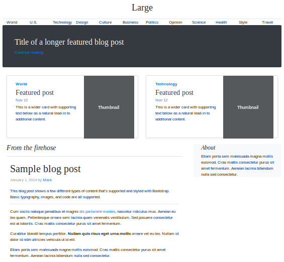

# additive-guis

GUIs could be buildable through declarative tuples where each statement changes the layout of an application. This is an idea inspired by RDF N3 tuples and [Bloom lang](http://bloom-lang.net/). I call these additive Guis because the  code that generates the UI is a monotonically increasing set of statements that can arrive in any order and still produce a sensible, valid output.

Each rule is relative to every other rule. The rules produce an emergent layout.

# Example

You have this set of predicates - a bit like N3 tuples.

```
    "LoginButton hasSize 2",
    "pagebody hasSize 8",
    "UsernameBox hasSize 2",
    "PasswordBox hasSize 2",
    "UsernameBox below UserArea",
	"PasswordBox rightOf UsernameBox",
    "PasswordBox sameRowAs UsernameBox",
    "UsernameBox withinSpace:1 PasswordBox",
    "UsernameBox leftOf UserArea",
    "UsernameBox withinSpace:1 UserArea",
    "LoginButton below PasswordBox",
    "bottomLinks below pagebody",
    "pagebody centered screen",
    "HeroText centered screen", 
    "sidemenu leftOf HeroText",
    "HeroText leftOf UsernameBox",
    "HeroText below LoginButton",
    "PasswordBox under UserArea",
    "UserArea above UsernameBox",
    "LoginButton under PasswordBox",
    "pagebody below HeroText",
    "pagebody under HeroText"
]
```

This should produce a layout a bit like this. The centered predicate doesn't quite work just yet.



This prototype example (layout/layouter.py) uses constraint programming library ORTools to try place things into a Bootstrap grid. It's not very good just yet.

# The dream - Build GUIs with microblogging (or twitter tweets)

**What you say is what you get** - you make statements about the output of layout engine that you want to be true. The layout engine tries to sastisfy all your rules.
* I want GUIs to be manipulatable by lots of people via predicates.
 * Each predicate changes the tree where rendered HTML will be placed.
 * Widget HTML is produced through mapping and filtering collections as per a React GUI.
 * **Codeless layout** Stating facts about the layout means you do not need to manually position elements into a layout with code.
 * **Predicate join** If someone wants a one piece of data to appear next to another piece of data, from a different collection, there has to be some kind of join on the UI generation code for those two pieces of data. This is because you are generating two child widgets, each from their respect a mapping of a collection.
 
 This is an example, you have a form object with fields inside and you have an errors object with errors for each field. To join them together, you could use a predicate like this:
 
 ```
 predicates = [
    "errors.lastName above form.fields.lastName",
    "errors.lastName on:click my.form.fields.lastName.focus()
 ]
 ```
From the errors predicates you have available the form.fields.lastName context from errors.lastName predicates due to the above predicate. And from the fields object, you should be able to access the current error. It's cyclical. How errors.lastName and form.fields.lastName renders is dependent on that react widget.

# Customizing your desktop

Adding an icon to your desktop operating system system tray should be really simple.

```
predicates = [
    "icon inside systemTray",
    "icon on:click menu.show()",
    "menu is hidden",
    "openGithub inside menu"
]
```


