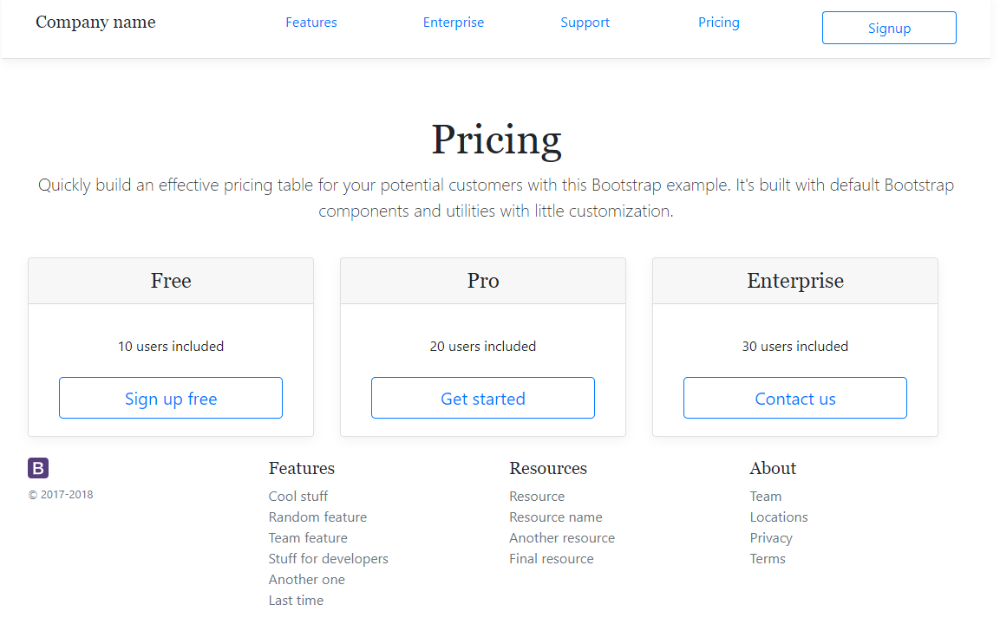

# additive-guis

This repository renders [Twitter bootstrap grid layouts](https://getbootstrap.com/docs/4.0/layout/grid/) This is a prototype. There is a live Javascript demo in `layout/layouter2.html`. There's an older python version too. They are both still in development.
This project could also be called commutative GUIs because the ordering of rule statements does not matter.


## declarative layouts - build layouts with statements rendering to HTML

GUIs are buildable through declarative tuples where each statement changes the layout of an application.  Rules in additive GUIs look like this - you describe the propositions of each widget on the screen and let the computer generate the layout.

```
todoField above todosList
todosList above todoFilters
submitTodo rightOf todoField
```

This is an idea inspired by  [RDF N3 triples](https://en.wikipedia.org/wiki/Notation3) and [Bloom lang](http://bloom-lang.net/). I call these additive GUIs because the code that generates the UI is a monotonically increasing set of statements and produce a valid output GUI. The UI is changed by adding more rules, it is additive. An online implementation would update in real time after a rule has changed. `layout/layouter2.html` is an online live implementation example.

The live demo also features some interactive features, such as the following:

## Toggles

```
showButton toggles hiddenItem
```

**toggles** toggle the visibility of another widget on the screen.


## Emits/receives

```
folderList emits emails
emailList receives emails
```

**emits**/**receives** controls data flow between widgets on the screen. If a list should control what appears in another widget on the screen, then clicking on the emitter will cause the receiver to change.

## Editable

**editable** enables content editable on a field that is being rendered and enables two way binding of the data

```
var template = {
	"predicates": [
		"dataList mappedBy dataItem",
		"dataList backedBy data",
		"dataList key .title",
		"dataList editable title"
	],
	"data": [
		{"title": "item 1"}	
	]
}
```

# Monotonically increasing statements

Why is it important that the tuples are monotonically increasing? This is due to a property of [CRDT](https://en.wikipedia.org/wiki/Conflict-free_replicated_data_type) sets whereby they can be changed independently on different machines and unlike HTML, can be merged safely without conflict. HTML is difficult to diff as it is not line based. I plan to use [Automerge](https://github.com/automerge/automerge) to turn the additive GUI data structure into a CRDT that people can modify in parallel and still produce valid GUIs. This will let developers merge GUIs at run time.


# Example

You have this set of predicates - a bit like N3 tuples - of how your page should be put together and behave. The following is a port of the [Bootstrap's Pricing example](https://getbootstrap.com/docs/4.0/examples/pricing/) as an additive GUI.

```
var template = {
	"data": {
	
	},
	"predicates": [
		"header above pricing",
		"header hasClass d-flex flex-column flex-md-row align-items-center p-3 px-md-4 mb-3 bg-white border-bottom box-shadow",
		"footer below pricing"
		
	],
	"widgets": {
		"header": {
			"predicates": [
				"companyName leftOf topMenu",
				"companyName hasSize 3"
			]
		},
		"companyName": {
				"react": CompanyName
		},
		"topMenu": {
			"predicates": [
				"Features leftOf Enterprise",
				"Enterprise leftOf Support",
				"Support leftOf Pricing",
				"Signup hasClass btn btn-outline-primary",
				"Signup rightOf Pricing"
			]
		},
		"Features": {
			"react": MenuLink,
			"data": {
				"name": "Features"
			}
		},
		"pricing": {
			"predicates": [
				"pricingIntro above priceTable",
				"pricingIntro hasClass pricing-header px-3 py-3 pt-md-5 pb-md-4 mx-auto text-center",
				"priceTable isA row",
				"priceTable hasClass card-deck"
			]
		},
		"pricingIntro": {
			"react": PricingIntro
		},
		"priceTable": {
			"predicates": [
				"free hasClass text-center card mb-4 box-shadow",
				"free withoutClass col",
				"pro hasClass text-center card mb-4 box-shadow",
				"pro withoutClass col",
				"enterprise withoutClass col",
				"enterprise hasClass text-center card mb-4 box-shadow",
				"free leftOf pro",
				"enterprise rightOf pro"
			]
		},
		"free": {
			"predicates": [
				"planTitle above price",
				"planTitle withoutClass col",
				"planTitle hasClass planTitle",
				"features below price",
				"callToActionButton below features"
				
			],
			"data": {
				"title": "Free",
				"price": "0",
				"features": ["10 users included"],
				"buttonText": "Sign up free"
			}
		},
		"pro": {
			"predicates": [
				"planTitle above price",
				"planTitle withoutClass col",
				"planTitle hasClass planTitle",
				"features below price",
				"callToActionButton below features"
			],
			"data": {
				"title": "Pro",
				"price": "24",
				"features": ["20 users included"],
				"buttonText": "Get started"
			}
		},
		"enterprise": {
			"predicates": [
				"planTitle above price",
				"planTitle withoutClass col",
				"planTitle hasClass planTitle",
				"features below price",
				"callToActionButton below features"
				
			],
			"data": {
				"title": "Enterprise",
				"price": "250",
				"features": ["30 users included"],
				"buttonText": "Contact us"
			}
		},
		"planTitle": {
			"react": PlanTitle
		},
	
		"price": {
			"react": PriceComponent
		},
		"features": {
			"react": FeaturesComponent
		},
		"callToActionButton": {
			"react": ActionComponent
		}
	}

}
```

This prototype example (layout/layouter2.html) tries to place things into a Bootstrap grid.



# GUIs are data

As a demonstration of how compact additive guis are to render interactive displays, this is an example Email viewer written as an additive GUI. You can run this yourself in `layout/layouter2.html`. Feel free to experiment with the syntax on the left of the live additive GUI editor. Try changing the order of your commands and your GUI will still appear the same way.

## Email viewer 

This data produces an email viewer whereby you can select folders and select emails. It will look terrible because it's not styled.

```
{
	"data": {
		"folders": [
			{
				"name": "inbox",
				"label": "Inbox",
				"emails": [
					{
						"subject": "Additive GUIs are compact",
						"from": "Samuel Squire",
						"body": "You can get a lot of behaviour for free",
						"to": "Samuel Squire <sam@samsquire.com>"
					},
						{
						"subject": "Re: Additive GUIs",
						"from": "Frank Joy",
						"body": "Sure are compact",
						"to": "Samuel Squire <sam@samsquire.com>"
					}
				
				]
			},
			{
				"name": "important",
				"label": "Important",
				"emails": [
					{
						"subject": "An important email",
						"from": "Samuel Squire <sam@samsquire.com>",
						"body": "Hello Samuel, this is an important email"
					}
				
				]
			}
		
		]
	},
	"predicates": [
		"folderList",
		"mailArea",
		"folderList hasSize 2",
		"mailArea rightOf folderList",
		"folderList backedBy .folders",
		"folderList mappedTo folderItem",
		"folderList key .name",
		"folderList hasClass folder-list"
	],
	
	"widgets": {
		"mailArea": {
			"predicates": [
				"emailList",
				"mailPreview",
				"emailList above mailPreview",
				"emailList mappedTo emailItem",
				"emailList is grid",
				"emailList key .subject",
				"mailPreview mappedTo email",
				"emailList hasClass email-list",
				"mailPreview hasClass mail-preview",
				"mailPreview key .subject"
			]
		
		},
		
	
		"folderItem": {
			"predicates": [
				"folderName",
				
				"folderName is label",
				"folderName hasContent .label",
				"folderName selects emailList",
				"folderName emits .emails"
			]
		},
		"emailItem": {
			"predicates": [
			    "from hasSize 5",
				"subject hasSize 4",
				"from",
				"subject",
				"sentDate",
				"from is label",
				"subject is label",
				"sentDate is label",
				"from hasContent .from",
				"subject hasContent .subject",
				"sentDate hasContent .sentDate",
				"from leftOf subject",
				"subject leftOf sentDate",
				"subject selects mailPreview",
				"subject emits .",
				"from selects mailPreview",
				"from emits ."
			]
		},
		"email": {
			"predicates": [
				"toLabel",
				"to",
				"fromLabel",
				"from",
				"subject",
				"to hasSize 5",
				"toLabel hasSize 1",
				"subjectLabel",
				"subject hasSize 5",
				"subjectLabel hasSize 2",
				"mailBody",
				"toLabel is label",
				"to is label",
				"subjectLabel is label",
				"subject is label",
				"mailBody is html",
				"from rightOf fromLabel",
				"fromLabel above toLabel",
				"from hasContent .from",
				"fromLabel hasContent From",
				"fromLabel hasSize 1",
				"from above subject",
				"from above subjectLabel",
				"from above mailBody",
				"to above mailBody",
				"to above subject",
				"toLabel above subject",
				"subject above mailBody",
				"subjectLabel above mailBody",
			
				"toLabel leftOf to",
				"toLabel hasContent To",
				"subjectLabel leftOf subject",
				"subjectLabel hasContent Subject",
				"to hasContent .to",
				"subject hasContent .subject",
				"mailBody hasContent .body"

	
				
			]
		}
	}
}
```


# The dream - Build GUIs with microblogging (or twitter tweets)

**What you say is what you get** - you make statements about the output of the layout engine that you want to be true. The layout engine tries to sastisfy all your rules.
* **Update GUIs while they are running** I want to be able to introduce widgets to a running GUI with predicates.
* **Community written GUIs** I want a community of people updating and customizing GUIs at the same time by lots of people via simple predicates.
 * Each predicate changes the tree where rendered HTML will be placed.
 * Widget HTML is produced through mapping and filtering collections as per a React GUI.
 * **Codeless layout** Stating facts about the layout means you do not need to manually position elements into a layout with code.
 * **Predicate join** Like an SQL join, If someone wants a one piece of data to appear next to another piece of data, from a different collection, there has to be some kind of data join so that your template can render. Each component on the screen is mapping JSON data collection to UI widgets.
 * **Creating new features with statements** It should be possible to add an expression to a running GUI to extend it in ways that the author did not anticipate. This can be done with an interactive predicate join. 
 
 # GUIs that multiple people can hack on without trampling eachother's changes
 
Changing the layout is accomplished by adding statements or removing statements.
 

## Summary


* **Each rule is relative to every other rule simultaneously**
* Predicates are currently three words long. These are are subject predicate object. A widget is created by mentioning it and defined further in the `widgets` key below.
* The rules together produce an emergent layout.

Here's a list of predicates implemented so far:

## emits

Emits the data that was used to render this element when clicked. Used to change what data another widget is rendering.

## selects

Configures which widget an emitted item goes into

## mappedTo

Configures what widget to map the data as.

Equivalent to:

```
data.map(mappedBy);
```

## backedBy

The data used to render this widget. Equivalent to:

```
backedBy.map(mappedTo);
```


# leftOf

The widget should be to the left of another widget.

# rightOf

The widget should be to the right of another widget.

# above

The widget appears somewhere above - nearer the top of the screen compared to the other widget.

# below

The widget appears below the other widget - nearer the bottom of the screen.

## Tweaking

If the layout is not how you want it to appear - such as spacing is missing, you either:

* add more rules to get the layout you want
* add additional classes


 # Interactive predicate join
 
This is not implemented yet.
 
Imagine that you have a screenful of widgets, such as a mail client. On the left is a set of email folders. In the middle is a list of emails and below the list of emails is an email viewer. We could have components such as Layout, FolderList, FolderItem, EmailList, EmailItem, EmailViewer components. As a power user, I want to extend this GUI to add a new feature. For example, I want to add a widget to the screen next to each email item in the email list. Imagine I want to insert an attachment icon if an email has an attachment. To introduce this widget in a traditional architecture, I would have to find the code for the gridview and add a column to the gridview.

There are a number of ways a declarative UI would allow changes online, while the GUI is running:

* In a declarative additive GUI, I should be able to right click the email list view on the email list and a context menu would appear. I can click 'Insert rightOf'.

* After selecting 'Insert rightof', I should be able to interrogate what context is available at a point I selected. The context is the lists being mapped over to generate this part of the GUI. For the list of emails, this data is the currently selected folder, the list of emails being rendered plus the current email on the screen being rendered.


# What I want to see in the future with additive guis

## Customizing your desktop

Adding an icon to your desktop operating system tray should be really simple.

```
predicates = [
    "icon inside systemTray",
    "icon on:click menu.show()",
    "menu is hidden",
    "openGithub inside menu"
]
```

## Adding icon overlays to icons in file manager

```
predicates = [
   "overlayDirtyIcon isA image(unchecked_changes.png)"
   "overlayDirtyIcon over file{dirty==true}"	
]
```

## Extending context menus

```
{
	"predicates": [
		"outsource isA menuItem",
		"outsource hasLabel \"Outsource\"",
		"outsource inside fileContextMenu",
		"outsource on:click exec(\"outsource\", this)"
	]
}
```


